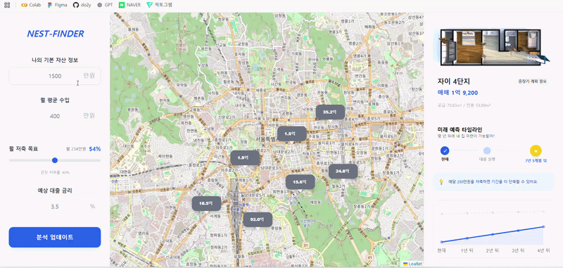

## 🏠 자산 기반 부동산 구매 시뮬레이션 대시보드

> 현재 자산과 저축 계획을 기반으로 매수 가능한 부동산 매물을 탐색하고 <br>
> 미래 자산 흐름을 시뮬레이션하는 웹 대시보드입니다. <br>
> 사용자의 자산 상황에 맞춰 예상 매수 시점과 자산 변화를 시각적으로 보여줍니다.

<br>

### 🎞 Preview

<p align="center">

</p>
<br>

## ⁘ 기능 소개

#### 1. 지도 기반 매물 탐색

Leaflet.js를 활용하여 매물 위치를 지도 위 마커로 표시합니다.  
사용자는 지도에서 매물을 선택해 가격 정보를 확인할 수 있습니다.

#### 2. 자산 기반 매수 시점 계산

사용자의 현재 자산과 월 저축액을 기준으로  
선택한 매물을 구매하기까지 필요한 예상 기간을 계산합니다.

#### 3. 자산 성장 그래프

Chart.js를 사용해 향후 자산 변화를 그래프로 시각화합니다.  
저축액을 변경하면 그래프가 함께 업데이트됩니다.

#### 4. 대시보드 UI

지도와 자산 분석 결과를 한 화면에서 확인할 수 있도록  
Grid 레이아웃 기반의 대시보드 형태로 구성했습니다.

<br>

## 📂 프로젝트 구조 </b>

<br>

```
nest-finder
│
├── data
│   └── data.js        # 매물 데이터
│
├── public
│   ├── assets         # 이미지
│   ├── index.html     # 메인 페이지
│   ├── script.js      # 지도 및 계산 로직
│   └── style.css      # UI 스타일
│
└── server.js          # Express 서버
```

<br>

## ⚙ Tech Stack

- JavaScript
- Node.js
- Express
- Leaflet.js
- Chart.js
